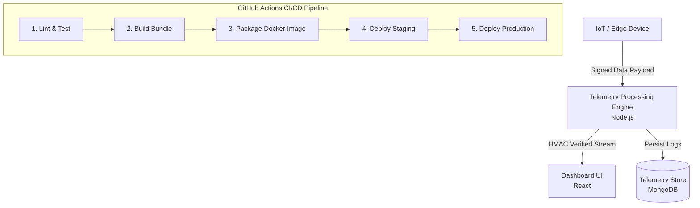

# SentinelMesh: Zero-Trust Edge Telemetry Engine

SentinelMesh is a real-time, zero-trust telemetry processing platform designed to ingest, cryptographically verify, and visualize high-frequency edge device data.

---

## Features

- **Zero-Trust Verification:** Inbound edge payloads are validated using HMAC cryptographic signatures.
- **Real-Time Streaming:** Bi-directional telemetry transmission powered by WebSockets.
- **Automated CI/CD Pipeline:** Multi-stage GitHub Actions workflows covering linting, testing, Docker builds, and deployment verification.

---

## Architecture Overview


---

## Quick Start

1. Clone the repository:
   ```bash
   git clone https://github.com/delta528/sentinel-mesh.git
   ```
2. Install dependencies:
   ```bash
   npm install
   ```
3. Run tests:
   ```bash
   npm test
   ```


